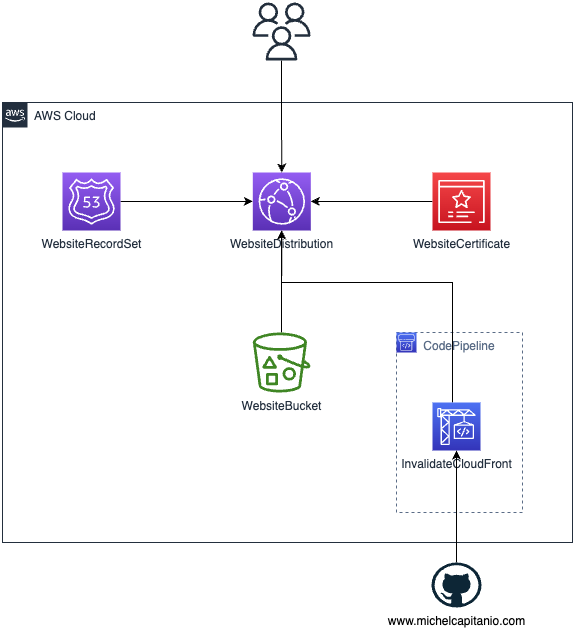

# My Personal Website

My personal website at www.michelcapitanio.com.

The cloudformation script allows to provision the website infrastructure, formed by:

- Two S3 buckets, one which host the website files the other one to implement the redirection from the naked domain to the www.
- A CloudFront distribution
- An SSL Certificate issues by the ACM
- Two Route53 record set, one CNAME which points to the CloudFront distribution and an ALIAS record set for the naked domain, which points to an S3 Bucket for the redirection to the www.

The stack parameters are:

1. **WebsiteName**: The naked domain
2. **HostedZoneId**: The id of the hosted zone in Route53.

## Diagram

